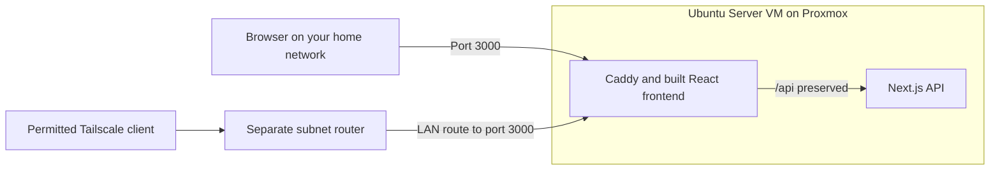

# HomeLab

**Current status:** the Proxmox sections use temporary sample data and their
service actions remain disabled. **TV & Movies** adds an optional TMDB catalogue,
Prowlarr search and TorrServer playback through backend APIs. It requires private
network configuration and your own credentials. Follow the
[TV & Movies setup and verification guide](docs/tv-media.md). Live media services
still need verification on your homelab; implementation tests used mocks.

## How it fits into a home lab

The reference setup runs Docker Engine in an Ubuntu Server VM on Proxmox VE.
Browsers on your home network reach the dashboard through a single published
port. Optional remote access uses a separate Tailscale subnet router.



| Component | What it does | Container port |
| --- | --- | --- |
| `frontend` | Caddy serves the Vite build, handles SPA routes, and proxies `/api` | 8080, published as host port 3000 |
| `backend` | Next.js standalone server hosts API routes | 3001, unpublished |

Both containers run as non-root users. The backend uses outbound network access
for configured media integrations.

## Try it locally with Docker

Install Docker Engine with the Compose plugin on Linux, or
[Docker Desktop](https://docs.docker.com/desktop/) on Windows/macOS. For Windows,
use its Linux container engine and keep Docker Desktop running. You do not need
Node.js installed on the host for Docker builds.

Clone the repository:

```sh
git clone https://github.com/olivier-hamel/HomeLab.git homelab
cd homelab
```

Create missing environment files. These commands preserve existing files.

On Linux/macOS:

```sh
umask 077
test -e .env || cp .env.example .env
test -e backend/.env || cp backend/.env.example backend/.env
```

On Windows PowerShell:

```powershell
if (!(Test-Path .env)) { Copy-Item .env.example .env }
if (!(Test-Path backend/.env)) { Copy-Item backend/.env.example backend/.env }
```

The root example binds to `127.0.0.1:3000` for local use. If you already have a
`.env`, check its address and port before starting. No credentials are required
to view the sample dashboard. TV & Movies stays disabled until configured.

Build and start the stack from the repository root:

```sh
docker compose config --quiet
docker compose build --pull
docker compose up -d --wait --wait-timeout 180
docker compose ps
```

Open [http://localhost:3000](http://localhost:3000). Check
[/healthz](http://localhost:3000/healthz) for frontend health and
[/api/health](http://localhost:3000/api/health) for the API response
`{"status":"ok"}`. A successful API check verifies the proxy connection; the
dashboard will still show sample data.

View logs with `docker compose logs -f --tail=100`. Stop the stack with
`docker compose stop`; start it again with `docker compose up -d --wait`.
In Docker Desktop, the project and its two services appear under **Containers**.

## Run it on your home server

Follow the [deployment guide](docs/deployment.md) for:

- Preparing an Ubuntu VM on Proxmox and installing Docker.
- Creating a checkout owned by your administrator account.
- Configuring your own LAN address and optional Tailscale access.
- Checking health, proxy routing, and container permissions.
- Pulling updates, restarting services, and preserving future data.
- Safely migrating a checkout nested under a `services/` directory.
- Planning a shared HTTPS proxy as your lab grows.

The guide uses example hostnames, usernames, and private IP addresses. Substitute
your own settings. Publishing the source code does not require making your
running dashboard internet-accessible; this setup is intended for your home
network and permitted remote clients.

## Develop without Docker

Install [Node.js 24](https://nodejs.org/en/download), including npm. The root
`.nvmrc` and both apps' `engines` fields select the Node 24 release line.
Each app has its own `package.json` and npm lockfile.

From the repository root, start the frontend in one terminal:

```sh
cd frontend
npm ci
npm run dev
```

In a second terminal, start the backend:

```sh
cd backend
npm ci
npm run dev
```

Open `http://localhost:3000`. Vite proxies `/api` and `/api/*` to the local backend
on port 3001, preserving the path. Browser API calls should use relative URLs,
such as `fetch('/api/health')`. Docker service names belong in server-side proxy
configuration.

Run the checks inside **each** app directory:

```sh
npm run lint
npm run typecheck
npm test
npm run build
```

The existing `npm start` commands remain available for manual production previews.
The frontend preview serves `dist` and has no API proxy; use Docker Compose to
test the full production path. Stop a local Docker stack using port 3000 before
starting Vite on that same port.

## Repository layout

```text
compose.yml                  Production services and network
.env.example                 Compose settings for your local copy
docs/deployment.md           Home-server setup and operations guide
frontend/
  src/                       Dashboard UI and sample data
  vite.config.ts             Development server and API proxy
  Caddyfile                  Production static serving and API proxy
  Dockerfile                 Node build and non-root Caddy runtime
  package.json               Frontend scripts and dependencies
backend/
  src/app/api/health/route.ts Health endpoint
  next.config.mjs            Next.js standalone output
  Dockerfile                 Node build and non-root standalone runtime
  .env.example               Backend runtime configuration template
  package.json               Backend scripts and dependencies
```

Keep real `.env` files, SSH keys, and application data out of Git. `VITE_*`
variables are public values compiled into browser assets, so they must never
contain credentials. See the deployment guide's
[configuration section](docs/deployment.md#4-configure-your-instance) for the
difference between Compose settings, backend runtime variables, and frontend
build-time values.
