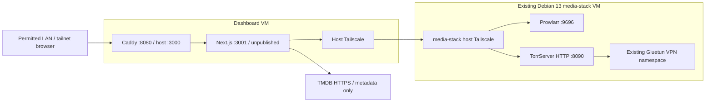

# TV & Movies

The optional TV page browses TMDB metadata, searches existing Prowlarr indexers,
selects TorrServer files, and plays same-origin video. Other dashboard sections
still show sample data. Browsing a title never starts a torrent.

**Verified on September 9, 2026:** lint, typecheck, build and 52 focused tests in
both apps; actual Caddy 2.11.4 → Next.js 16.3.4 standalone → mocked services →
Chrome playback of a licensed MP4, seeking, stopping/cancellation, range/HEAD/416,
link revocation, bundled/local subtitles, mocked Gemini recommendations and dismissal,
and an unsupported-format error fixture. Layouts fit at 1440,
768, 390 and 320 pixels. A live SubDL search for Obsession (2026) returned six
English releases / seven individual subtitle files, and one authenticated raw
subtitle download was verified. **Live torrent playback and VM deployment were not tested.**
Docker Desktop's engine was unavailable. Your installed TorrServer schema/version,
authentication, real indexers, container networking and actual devices remain
to verify with the steps below.

## 1. Where things run



`http://100.64.162.49:9696` and `http://100.64.162.49:8090` are **backend**
configuration examples. The media VM's Docker addresses `172.31.250.2/.3`
are not reachable addresses for the separate dashboard VM. `localhost` inside
the backend is that container, not the media VM. The dashboard VM's actual
IP/hostname is unknown; substitute your own address in every example.

The separate subnet router used for browser access does **not** prove backend
access to the media VM's Tailscale IP. Do not assume `home.arpa` resolves inside
the container. Test from the backend container, not only from your PC or host.

## 2. Restrict access before enabling media

There is no login system. All permitted LAN/tailnet clients are trusted to
search and add torrents. Media is disabled until explicitly configured.
Keep root `.env` bound to loopback on your PC or your VM's specific LAN/Tailscale
IP. Do not enable router port forwarding, Funnel or public ingress.

Caddy rejects media requests from public socket-peer addresses and does not
trust client-supplied X-Forwarded-For for this rule. A reverse proxy or NAT on
a private address can hide public clients: that ingress must independently
enforce private access. Origin checks and anonymous signed session cookies
are CSRF controls, **not user authentication**. Vite lacks Caddy's network
rule; use loopback/firewall restrictions for development.

Keep the existing non-root users, dropped capabilities, no-new-privileges,
health checks and unpublished backend port. This feature needs no Docker
socket, privileged container, extra frontend, transcoder or VPN credentials.

## 3. Dashboard-host Tailscale connectivity

**Dashboard VM host:** inspect first:

```sh
command -v tailscale
tailscale status
```

If absent, use the official [Linux instructions](https://tailscale.com/docs/install/linux).
For the deployment guide's Ubuntu 24.04 host, install from the official apt repo:

```sh
curl -fsSL https://pkgs.tailscale.com/stable/ubuntu/noble.noarmor.gpg | sudo tee /usr/share/keyrings/tailscale-archive-keyring.gpg >/dev/null
curl -fsSL https://pkgs.tailscale.com/stable/ubuntu/noble.tailscale-keyring.list | sudo tee /etc/apt/sources.list.d/tailscale.list
sudo apt-get update
sudo apt-get install tailscale
sudo tailscale up
tailscale ip -4
tailscale ping 100.64.162.49
```

Join the same tailnet as media-stack. On an already joined host, preserve its
settings; do not blindly rerun `tailscale up` with different options. Do not
choose an exit node, advertise routes or reroute either VM through Proton.

**PC, Tailscale admin console:** add narrow access for the dashboard VM identity
to the media VM. For example, merge this object into your existing `grants`
array, replacing the source with the actual dashboard Tailscale IP:

```json
{
  "src": ["REPLACE_WITH_DASHBOARD_TAILSCALE_IP"],
  "dst": ["100.64.162.49"],
  "ip": ["tcp:8090", "tcp:9696"]
}
```

Do not replace the whole policy. Grants are additive: existing broad allow
rules may still permit more access. Review them while preserving your other
services. See [Tailscale grants](https://tailscale.com/docs/features/access-control/grants).
Docker bridge egress usually appears as the host identity; verify your actual
container path in step 6. If host access works but the container fails, inspect
host forwarding/firewall rules and grants without silently altering routes.

Keep Prowlarr on its existing normal outbound connection and TorrServer in
Gluetun's namespace. Preserve the tested kill switch. No Proton private key
belongs in this application.

## 4. Credentials and backend environment

**PC browser:**

1. Sign in to [TMDB](https://www.themoviedb.org/), open Settings → API and request
   API access if needed. Describe your private application truthfully and accept
   the terms. Copy the **API Read Access Token**. See [getting started](https://developer.themoviedb.org/docs/getting-started)
   and [Bearer authentication](https://developer.themoviedb.org/docs/authentication-application).
2. In your existing Prowlarr UI, open Settings → General → Security and copy
   the API key (show advanced settings if needed). Do not reset it or change
   indexers, Cloudflare handling or download-client settings.
3. Open TorrServer and `/swagger/index.html` through its existing permitted
   address. Check whether HTTP Basic auth is enabled. Use the existing
   credentials if required. `/echo` alone may be public even when controls
   require authentication.

**Dashboard VM, existing checkout** (substitute its real path):

```sh
cd /opt/stacks/homelab
umask 077
test -e .env || cp .env.example .env
test -e backend/.env || cp backend/.env.example backend/.env
mkdir -p backups
stamp=$(date +%Y%m%d-%H%M%S)
cp -p .env "backups/compose-env-$stamp"
cp -p backend/.env "backups/backend-env-$stamp"
chmod 600 .env backend/.env
nano backend/.env
```

Add missing entries from `backend/.env.example`; preserve existing values.
`backups/` is gitignored. Single-quote literal values containing `$` to avoid
Compose interpolation. Do not publish env files or full resolved Compose output.

Generate a secret **in the existing backend container** and paste it locally
into the env file:

```sh
docker compose exec -T backend node -e "console.log(require('node:crypto').randomBytes(32).toString('hex'))"
```

If no container exists, run that `node -e` command on your PC with Node 24.
Keep the generated output private.

| Variable in backend/.env | Meaning / default |
| --- | --- |
| `MEDIA_TRUSTED_NETWORK` | `false` disables media. Set `true` after securing access. |
| `MEDIA_ALLOWED_ORIGINS` | Exact browser origins, comma-separated, no trailing slash. PC example `http://localhost:3000`; deployment uses your actual VM URL. |
| `MEDIA_SESSION_SECRET` | At least 32 random characters; 64 hex recommended. Rotation invalidates sessions. |
| `PROWLARR_BASE_URL` | Backend-reachable HTTP(S) URL; example `http://100.64.162.49:9696`. A configured base path is supported. |
| `PROWLARR_API_KEY` | Existing Prowlarr key, sent as a server-side header. |
| `TORRSERVER_BASE_URL` | Backend-reachable HTTP(S) URL; example `http://100.64.162.49:8090`. |
| `TORRSERVER_USERNAME`, `TORRSERVER_PASSWORD` | Both blank, or both set for existing HTTP Basic auth. |
| `TMDB_READ_ACCESS_TOKEN` | Optional Bearer token. Direct source search works independently. |
| `GEMINI_API_KEY` | Optional server-side Gemini key for source assist; basic recommendations work without it. |
| `MEDIA_AI_TIMEOUT_MS` | `20000`; range 1000–60000 ms for a Gemini review. |
| `MEDIA_METADATA_TIMEOUT_MS` | `10000`; range 1000–60000 ms, for TMDB/TorrServer JSON. |
| `MEDIA_SEARCH_TIMEOUT_MS` | `20000`; range 1000–60000 ms per indexer, four concurrent. |
| `MEDIA_STREAM_HEADER_TIMEOUT_MS` | `90000`; range 1000–180000 ms. Keep below Caddy's 100-second header timeout, or adjust Caddy and rebuild together. |
| `MEDIA_STREAM_IDLE_TIMEOUT_MS` | `45000`; range 1000–180000 ms without data during an upstream read. No total video duration limit. |

Root `.env` still controls Compose. No secrets go in `VITE_*`, localStorage,
build arguments or images. A local Next build may trace local `.env` into
`.next/standalone`; never publish that build folder. Docker excludes env files
from its build context and loads credentials at runtime.

## 5. Build/restart the dashboard only

**Dashboard VM:** after reviewing and making this implementation available on
your tracked branch, inspect the checkout and record the old revision:

```sh
cd /opt/stacks/homelab
git status --short
git branch -vv
git rev-parse HEAD
```

Save the revision as `PREVIOUS_REVISION` in your notes. Resolve local changes
before pulling; never reset them. With a clean tracked checkout:

```sh
git pull --ff-only
docker compose config --quiet
docker compose build backend frontend
docker compose up -d --wait --wait-timeout 180
docker compose ps
```

An env-only change requires recreation, not just restart:

```sh
docker compose up -d --no-deps --force-recreate --wait backend
```

These commands affect this dashboard project only. Do not run them in
`/opt/media-stack/`. Do not delete volumes or change that VM's services.
No live deployment was performed during implementation.

## 6. Verify FROM THE BACKEND CONTAINER

**Dashboard VM, repo root:** pipe the read-only probe into the backend's own
process/network namespace. It uses the container's environment:

```sh
docker compose exec -T backend node --input-type=module < backend/scripts/check-media.mjs
```

The script prints HTTP status, sanitized versions and expected schema-path
presence, never private response bodies. Expect Prowlarr authenticated status
and TorrServer echo/Swagger to return 200. A 401/403 means the service is
reachable but access is denied. Timeouts can indicate routing, firewall/grants,
an incorrect address, or an unavailable service.

The usual gin-swagger schema is `/swagger/doc.json`. If it returns 404, use
the Swagger UI's Network tab to find your installed schema and compare manually.
Do not assume a schema 404 means the service itself is down.

**Dashboard browser:** TV & Movies → Check media connections checks Prowlarr
status and TorrServer echo plus the read-only `POST /torrents {action:"list"}`
to verify authentication. “Configured” only means settings are present.
`/api/health` remains independent and cannot prove media connectivity.

**Media VM, read-only inspection if needed:**

```sh
cd /opt/media-stack
docker compose ps
tailscale status
```

Confirm the existing TorrServer network namespace/kill switch without changing
settings. Avoid sharing full Docker inspection/environment output.

## 7. API assumptions and limits

Official source snapshots inspected September 9, 2026:

- Prowlarr [API docs](https://prowlarr.com/docs/api/), [OpenAPI at 693c7c3](https://github.com/Prowlarr/Prowlarr/blob/693c7c3b0e8ec6e9dd792c01e5fa1091260b3be1/src/Prowlarr.Api.V1/openapi.json),
  and [query parsing](https://github.com/Prowlarr/Prowlarr/blob/693c7c3b0e8ec6e9dd792c01e5fa1091260b3be1/src/NzbDrone.Core/IndexerSearch/NewznabRequest.cs).
  API v1; installed application version unverified.
- TorrServer [Swagger at 7325ba7](https://github.com/YouROK/TorrServer/blob/7325ba746f87a133e0847ab908a67891ffb8d385/server/docs/swagger.json)
  and its handlers. This is an upstream snapshot, **not your installed version**.
- TMDB [v3 movie search](https://developer.themoviedb.org/reference/search-movie),
  movie/TV popular lists, details with external IDs and TV season details.
- [Caddy reverse_proxy](https://caddyserver.com/docs/caddyfile/directives/reverse_proxy)
  and [log_skip](https://caddyserver.com/docs/caddyfile/directives/log_skip).
  Caddy 2.11.4 was exercised locally; Docker's `caddy:2-alpine` is checked separately.

Compare installed TorrServer behavior before a live add:

| Operation | Contract |
| --- | --- |
| Add/reuse magnet | `POST /torrents`, `{action:"add",link:magnet,save_to_db:false}`; upstream reuses by info hash. |
| Read metadata/status | `POST /torrents`, `{action:"get",hash}`. |
| Upload metainfo | `POST /torrent/upload`, multipart `file`; accepts single status or array. `save` is omitted because its presence can enable persistence even when the value is false. |
| Files | `file_stats[{id,path,length}]`; use the supplied IDs, not array offsets. |
| Stream | `GET /stream?link=<validated hash>&index=<validated file ID>&play`; HEAD forwards to the same handler. Verify HEAD on your installed version, as Swagger may advertise only GET. |

No preload endpoint is invented or required. Reading the selected stream drives
buffering. Missing optional fields remain unknown, including Go `omitempty`
zeros. No torrent is removed/dropped automatically. Closing stops this browser;
existing TorrServer cache/lifetime policy manages shared torrents.

Prowlarr uses GET search, never its POST grab/download-client action. At most
20 enabled torrent indexers are searched, four concurrently, 50 results each
per batch. UI pages contain 25 results; sorting applies to the loaded batch.
Next-batch availability depends on indexer pagination. Advertised capabilities
select `{imdbid:tt...}` or `{tvdbid:...}{season:1}{episode:2}` searches. Unsupported
IDs fall back to title/year or SxxExx. Editing the query disables ID preference;
uncheck it if an ID search has no matches. A reported matching title ID still
does not prove edition, episode, quality or availability.

Per-indexer failures retain successful results. Indexer status is checked too,
but some Prowlarr versions swallow errors as empty arrays. Empty results alone
cannot establish provider health. Seeder/leecher/peer counts are stale
observations, not playback-speed estimates. Only API-supplied counts are shown.

Authenticated download resolution accepts only the configured Prowlarr origin
and exact `/<indexerId>/download` path (including base path), strips query API
keys, and allows at most three same-target redirects or a magnet redirect.
Metainfo is capped at 4 MiB and uploaded to TorrServer. Off-origin/direct-indexer
HTTP URLs are rejected; use an authorized magnet fallback. The dashboard
downloads no torrent pieces and never fetches arbitrary browser-supplied URLs.
Manual v1 magnets accept only `xt`, `dn`, `tr`; HTTP metadata/web-seed parameters
are rejected. All torrent retrieval remains with TorrServer behind Gluetun.

Bounded in-memory storage: metadata 200 entries/10 minutes; searches 20 entries/
2 minutes; source choices 4000/10 minutes; sessions 256 and playback handles
128/8 hours; external links 256/15 minutes. Restart invalidates all of them.
Use one backend instance; multiple replicas need shared state. Limits include
600 global requests/minute, eight concurrent metadata/control requests, 32
streams globally, eight streams/session, eight searches/session/minute and
45 status polls/session/minute. Browser search deadline is 120 seconds and
initial metadata polling ends after about 60 seconds with retry/cancel.

### AI source assist

Set `GEMINI_API_KEY` in `backend/.env` using a key from
[Google AI Studio](https://aistudio.google.com/apikey), then restart the backend
(or recreate it with Compose to reload its env file). The integration uses
[`gemini-3.5-flash-lite`](https://ai.google.dev/gemini-api/docs/models/gemini-3.5-flash-lite)
and Google's [structured JSON generation API](https://ai.google.dev/api/generate-content).
The key stays on the backend. Searches and candidate listing metadata are sent
to Google; torrent links, indexer configuration, credentials and file contents
are excluded.

Search results appear with basic recommendations immediately, followed by the
Gemini review. Advice appears directly on each source row, without a separate
assist status box. The best available choice stays first, including when sorting
by seeders, size or title. Each listing has a **Good**, **Unsure** or **Sketchy**
verdict with at most one sentence explaining its main evidence or concern.
The target is direct browser playback at 1080p: format compatibility, healthy
seed counts, reasonable sizes, episode matches and suspicious release details
matter more than extra resolution. Listing metadata cannot verify actual
contents, safety or successful playback. Known format risks cannot be upgraded
to Good by the model.

**Doesn’t work** hides that release and matching title/size duplicates in the
current browser tab, stops its local player if selected, and highlights the next
ranked option without another Gemini call or starting a torrent. Dismissals
survive a refreshed search and tab reload; **Restore hidden sources** clears them.
This does not remove torrents from TorrServer or report failures to an indexer.

Gemini reviews at most the 60 most promising listings in each loaded batch;
the rest retain basic assessments. Missing keys, timeouts, quota errors and
invalid model output retain usable basic advice. Reviews and session-owned
search snapshots are bounded to 40 entries for two minutes, with 12 review
requests per session per minute and 60 globally. Responses enforce supplied
source IDs, known verdicts and a single short explanation; listing text is
treated as untrusted data. No live Gemini request was verified without a key;
the automated browser fixture mocks Gemini as well as the existing providers.

## 8. Playback and external players

Native controls, inline playback and available fullscreen support user-initiated
playback. No transcoding: H.264/AAC MP4 is a useful target, not a guarantee.
Extensions do not reveal actual codecs. MKV/HEVC/DTS may fail or have no audio;
HLS.js cannot automatically transcode it. Actual mobile/smart-TV support needs
device testing.

Download speed/connected peers come only from supplied TorrServer data.
Received bytes (`bytes_read_data`) are traffic totals; completed bytes
(`loaded_size`) are not configured cache capacity. Capacity is not estimated
in the UI. Buffer-ahead seconds come from the browser's real TimeRanges;
optional upstream preload data is torrent-wide and may include another viewer.
There are no artificial progress bars. A 30-second player wait produces a
stalled error and retry/alternate-source options.

The proxy preserves Range/If-Range, content headers and 200/206/416 with
backpressure and client-disconnect cancellation. Video bodies are not cached,
compressed or collected in memory. Caddy uses a **positive** 100 ms flush
interval; a negative interval would disable its upstream cancellation.
Stream headers have a 100-second Caddy / 90-second backend timeout. Caddy body
read/write timeouts are zero; the backend has a separate idle-read timeout.

External links point to this dashboard, work without browser cookies, expire
after 15 minutes and are scoped to one file. Revocation/expiry cancels active
requests and blocks new requests. Caddy skips media access logs. A player must
still reach the dashboard via LAN/tailnet; a separate login proxy can still
block VLC. Anyone with a link and network access can use it until expiry.
Download M3U or paste into VLC; there is no universal VLC launch integration.
Direct TorrServer URLs would require media-VM reachability/auth on the playback
device and are not emitted. No permanent service credentials appear in links.

### Subtitles

TV episodes and movies share the **Subtitles** controls below the video. Select
an SRT or VTT file included in the torrent, or choose **Load SRT / VTT** to open
a file from your computer. Select **Off** to hide captions. Choosing or changing
subtitles does not start or restart the video. For season packs, select the
subtitle file that matches the episode you chose.

Use **Earlier 0.5 s** or **Later 0.5 s** under **Subtitle timing** to correct
synchronization while watching. Negative offsets show captions earlier; positive
offsets delay them. **Reset timing** returns to zero, as does selecting a subtitle
file or another video. This works for torrent, local and SubDL subtitles without
restarting playback. Original cue timings are retained, including cues shifted
before zero, so adjustments remain reversible.

Local subtitles stay in the browser and are cleared when you close the player
or choose another video. Torrent and local subtitles need no additional account
or environment setting. Files are limited to 2 MiB and must use UTF-8 or UTF-16 with a BOM.
SRT timings are converted to [WebVTT](https://www.w3.org/TR/webvtt1/) for native
browser text tracks; VTT cue formatting and positioning are preserved.

Torrent subtitles use the existing authenticated TorrServer stream endpoint,
with the selected playback session and file IDs validated by the backend. The
subtitle body is size limited and has a 30-second total download deadline.
Embedded MKV subtitle tracks are not extracted.
ASS/SSA and image subtitles need another format or an external player. Browser
subtitle selections are not included in the external stream link/M3U; load
separate subtitle files directly in VLC when using that option.

#### Find subtitles online with SubDL

1. Get an API key from your [SubDL account panel](https://subdl.com/panel).
2. Add it to your existing `backend/.env`:

   ```dotenv
   SUBDL_API_KEY=your_subdl_api_key
   ```

3. Restart the development backend, or rebuild and recreate the deployed apps:

   ```sh
   docker compose build backend frontend
   docker compose up -d --force-recreate --wait
   ```

4. Choose a video, open **Find online subtitles**, select the language, and click
   **Search SubDL**. Review the matched title and release, then **Download & use**.
   You can do this before pressing Play. If a ZIP contains multiple SRT/VTT files,
   select **Use subtitle** beside the file for your movie or episode.

Catalogue searches retain their IMDb/TMDB IDs. For TV packs, the selected video's
SxxExx or NxNN filename supplies the episode where available. You can edit the
title, type, season and episode or uncheck catalogue matching to broaden a search.
SubDL returns subtitles for its first matching title; the UI names that title so
you can refine ambiguous searches. Up to 30 releases are requested, with up to
100 individual subtitle choices from expanded packs. No result auto-downloads.

The backend uses the [documented SubDL search API](https://subdl.com/api-doc)
and `unpack=1` for individual files where available. Other downloads are unpacked
in memory; nothing is extracted to disk. Standard stored/deflated ZIPs are limited
to 4 MiB, 100 entries and 30 SRT/VTT files, with at most 4 MiB of extracted subtitle
data in total. Each subtitle is limited to 2 MiB. Unsupported formats and corrupt
archives show a retry/alternate-release error.

The key is sent only from the backend to `api.subdl.com`. Download URLs are
restricted to `https://dl.subdl.com/subtitle/…`, and remain server-side along with
the key. SubDL sometimes appends `api_key` to its returned download links. The
backend verifies it matches the configured key, removes it from the stored URL,
and sends it as `x-api-key` only to the validated download host. Plain download
links use the anonymous IP allowance; authenticated links use the account's
download allowance. Account/search and download quotas apply, and errors direct
you to the relevant account or retry step. The
app does not purchase plans or use translation services. Local and torrent
subtitles continue working if SubDL is unavailable or unconfigured.

Searches have a 15-second deadline and a bounded five-minute cache. Results expire
after ten minutes and belong to the browser session and selected video. Downloads
have a 25-second deadline and require an explicit selection. SubDL subtitle files
remain available only in the current player, like local files. Changing subtitle
files preserves video playback; selecting Off while a download is pending keeps
captions off until you choose the downloaded file.

## 9. Live acceptance test

**PC/browser, through the deployed Caddy URL (not just Vite):**

1. Verify `/healthz`, `/api/health` and Check media connections. Browse a title
   and verify no torrent add. Select a TV season/episode and inspect its query.
2. Search a current publisher-authorized/public-domain release, verify its
   source/license and title/year, and choose it. If none is indexed, use its
   publisher's authorized magnet and record the indexer path as still unverified.
3. Wait for metadata. In a multi-file/season pack choose the actual video;
   confirm samples and subtitles are identifiable and nothing auto-plays.
4. Play known H.264/AAC MP4. Confirm picture, audio, buffering and playing states.
   Seek both directions; check same-origin requests and 206/Content-Range in
   browser Network tools. On HTTPS there must be no browser HTTP-media-VM request.
   Select a bundled SRT/VTT subtitle, switch it off, and load a local file. Confirm
   cues appear at the right time, including after seeking and in fullscreen.
   Changing subtitles should preserve the current video time. Try a malformed
   subtitle and confirm you can choose another file after the error.
5. Stop/close/navigate away. Video requests and polling end; another viewer
   continues and the shared torrent is not deleted.
6. Try a known incompatible file/audio codec. Confirm a useful error or note
   silent audio. Create a link/M3U, try VLC on a permitted device, revoke it,
   and confirm new requests return 410. Repeat on your actual tablet/mobile/TV.
7. Exercise missing credentials, bad auth, no peers, unavailable services,
   indexer failures and metadata timeout. Restore only the settings you changed;
   do not disable Gluetun to manufacture a failure.

**Dashboard VM:** verify production config and unchanged container identities:

```sh
docker compose exec -T frontend caddy version
docker compose exec -T frontend caddy validate --config /etc/caddy/Caddyfile --adapter caddyfile
docker compose exec -T frontend id
docker compose exec -T backend id
```

For a temporary external link from the player, use `curl -I` (HEAD),
`curl -H 'Range: bytes=0-1023'` (206), and a range beyond EOF (416) from a
permitted PC. Treat the link as a credential; do not publish it or place it in
shared logs. HEAD sends no body. Validate seeking through your actual Compose,
TLS and proxy topology.

## 10. Reproduce mock tests on a PC

**PC, each app directory, Node 24:**

```sh
npm ci
npm run lint
npm run typecheck
npm test
npm run build
```

Backend tests cover normalization, capability search, metadata/source distinction,
partial failures, private credentials, bounds/timeouts, rejected URLs/redirects,
CSRF/session isolation, multiple files, ranges/HEAD/416, backpressure, cancellation
and revocation, plus subtitle session isolation, file validation and download
bounds. Frontend tests cover title/episode queries, sorting, subtitle conversion,
encodings, malformed files and reversible positive/negative timing offsets.
Timing controls passed frontend tests, lint and build; their browser check remains
pending. Browser tests check bundled SRT and local SRT/VTT
cues, switching subtitles off through either control, and error recovery while
the video continues playing. SubDL adapter tests cover movie/episode filters,
empty/error responses, credentials, quotas, restricted URLs, playback ownership,
raw downloads, credential-bearing links and bounded ZIP extraction. Rejected
download links produce an integration error instead of a false empty search.
Browser tests cover SubDL search,
downloads before playback, ZIP file selection and a download completing after Off.

`scripts/test-tv-media.mjs` runs built React, Next standalone, real Caddy and
hidden Chrome against loopback mock services. Its TMDB/SubDL fetch override is loaded
only into that test process; production has no mock toggle or alternate TMDB
origin. It overrides all media credentials with fixture values.

**PC PowerShell, repo root:** obtain Caddy from [official releases](https://github.com/caddyserver/caddy/releases)
and verify its checksum, have Chrome installed, and supply a licensed H.264/AAC
MP4. The implementation run used the Blender Foundation's Big Buck Bunny trailer,
CC BY 3.0, mirrored at `https://media.w3.org/2010/05/bunny/trailer.mp4`. Keep binaries
and fixtures outside Git; the mock run retrieves no torrent pieces.

```powershell
$env:CADDY_BIN = 'C:\tools\caddy.exe'
$env:CHROME_BIN = 'C:\Program Files\Google\Chrome\Application\chrome.exe'
$env:TV_TEST_MP4 = 'C:\test-media\authorized-h264-aac.mp4'
node scripts/test-tv-media.mjs
```

The same environment variables work with Linux/macOS binary paths. Reports and
screenshots go to `frontend/node_modules/.cache/tv-review/`. The tracked Caddyfile
gets only local root/upstream/listener substitutions and a loopback bind;
proxy rules/timeouts remain intact. The error fixture supplies undecodable bytes
with an AVI MIME type. That tests fallback UI, **not real HEVC/MKV/DTS support**.
Docker execution, live networking, actual seeding and device tests remain pending.

## 11. Rollback without deleting volumes

**Dashboard VM:** retain the same Compose project name/bind address and your
private env backups. With a clean tracked checkout, create a rollback branch
using the saved revision rather than resetting files:

```sh
cd /opt/stacks/homelab
git status --short
git switch -c rollback-tv PREVIOUS_REVISION
docker compose config --quiet
docker compose build backend frontend
docker compose up -d --wait --wait-timeout 180
```

Replace `PREVIOUS_REVISION` with your saved commit ID. If old backend env values
are needed, first back up the current file and restore the specific private
backup you recorded, then recreate the backend. To disable media immediately,
set `MEDIA_TRUSTED_NETWORK=false` and recreate the backend. Do not use
`docker compose down -v`, volume pruning or resets of uncommitted work.
No rollback command changes media-stack or deletes its torrents.

## Credits

The catalogue's About TMDB disclosure includes the required disclaimer and an unmodified approved
blue short logo, less prominent than HomeLab branding. See [TMDB FAQ](https://developer.themoviedb.org/docs/faq)
and [logos & attribution](https://www.themoviedb.org/about/logos-attribution).
`frontend/public/tmdb-logo.svg` is the approved asset from that branding page.
Review TMDB's applicable terms before changing this private app's usage.
